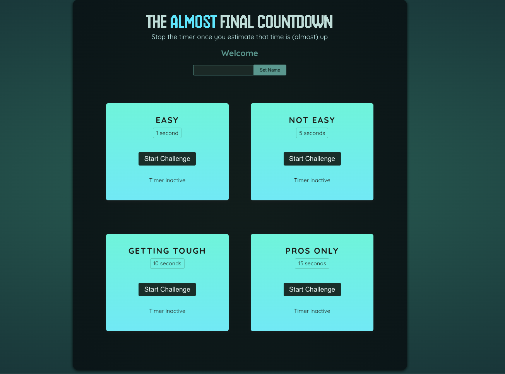
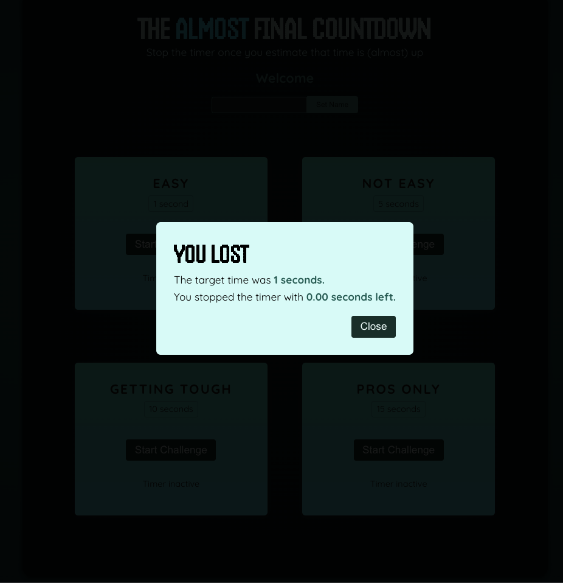
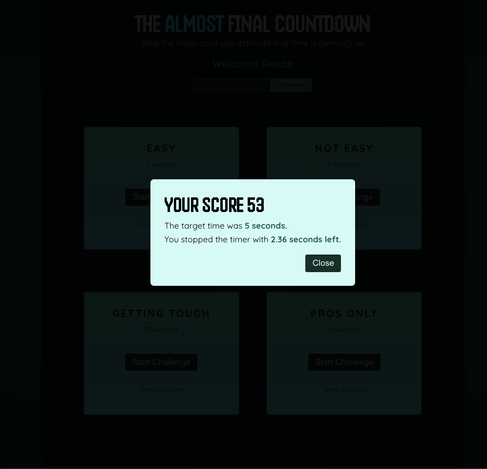

# React Timer Challenge Game

A fun and interactive timer-based game built with React where players test their timing skills. Players attempt to stop the timer as close as possible to the target time to achieve the highest score.

## Features

- Player name customization
- Multiple difficulty levels with different target times
- Real-time timer display
- Score calculation based on timing accuracy
- Modal feedback system for game results
- Responsive design

## Screenshots

## Screenshots

*Main game interface showing multiple difficulty levels from Easy to Pros Only*

*Game over screen showing when player runs out of time*

*Score display showing player performance with remaining time*

## Technologies Used

- React.js
- React Portals (for modals)
- React Hooks (useState, useRef, useImperativeHandle)
- Modern JavaScript (ES6+)
- CSS for styling

## Installation

1. Clone the repository
bash
git clone [your-repository-url]

3. Start the development server
## How to Play

1. Enter your name in the player section
2. Choose a challenge level:
   - Easy (1 second)
   - Not Easy (5 seconds)
   - Getting tough (10 seconds)
   - Pros only (15 seconds)
3. Click "Start Challenge" to begin the timer
4. Try to stop the timer as close as possible to the target time
5. Your score is calculated based on how close you get to the target time
## Features in Detail

### Player Component
- Allows users to set their name
- Persists player name throughout the game session

### Timer Challenge Component
- Multiple difficulty levels
- Real-time timer tracking
- Visual feedback during active timing
- Stop/Start functionality

### Result Modal
- Displays final score
- Shows remaining time
- Indicates win/loss status
- Option to try again

## Contributing

Contributions are welcome! Please feel free to submit a Pull Request.

## License

This project is licensed under the MIT License.
